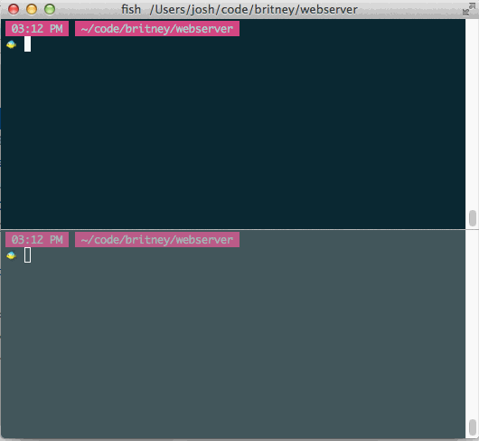
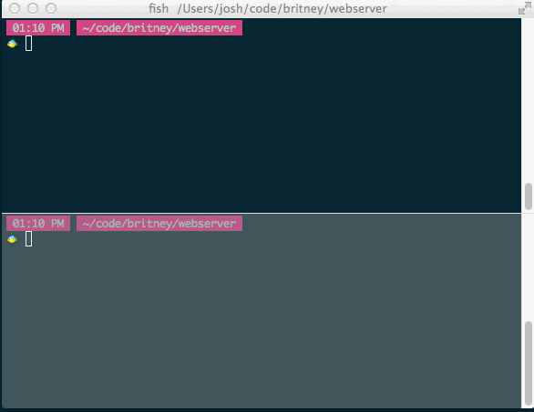

# Building a webserver

It's fun to get out of the web app world on occasion,
and it's useful to understand what's underneath the abstractions we use.

One of the things we use are servers like Apache, Nginx, Unicorn, Puma, Mongrel, Webrick, etc.

Our goal here is to build our own server for the purpose of understanding
what web servers do, how they might work, and what that implies for our applications
sitting above them.


## Responsibilities:

1. **Start a TCP Server on a port**

  You'll need to accept the port and use the `socket` standard library
  to start the server on that port (more details below)
1. **Accept web requests**

  a browser can connect to your server and send the requestinformation,
  e.g. a `GET` request to `/users/5`
1. **Parse the request**

  Parse the relevant information from the request.
  Save that information on an object to give your server's users access to it.
  It will need to have methods that provide it (alter as appropriate):

  * request method (GET, POST, etc)
  * Request uri (e.g. "/users/5?verbose=true")
  * Protocol version (e.g. "HTTP/1.1")
  * body (an IO object pointing to the beginning of the body -- this would be
  * Headers (e.g. {"User-Agent" => "curl/7.30.0", "Host" => "localhost:8889", ...})

  Other fields that might make sense (not really sure, these would be parsed from the headers, but maybe just put that on the app)

  * Host (e.g. "localhost")
  * Port (e.g. 80, 8080, 8889, etc)
  * content length (the length of the body, as parsed from the header)
  * content type (the content type, as parsed from the headers)
1. **Application handles the request**

  Hand the request to a piece of code that decides what to do with it (this piece of code will eventually be Rack).

  You'll have to figure out how this interface should be.
  Probably choose it based on what makes the server easy to test.
1. **Provide a response object**

  It will need to have methods that allow it to set:

  * Status code (e.g. 200 OK)
  * Headers (e.g.  "Content-Type: text/html; charset=ISO-8859-1")
  * Body (e.g. HTML, maybe takes a string, or maybe an enumerable that yields strings so you could give it an IO object open to some file)

  Maybe you give one to the application code that they can call the methods on.
  Maybe they instantiate their own and hand it back to your code.
  Again, let "what's easiest to test" inform your decision.
1. **Write the HTTP response**

  Using the response object, write the HTTP response back to the socket.
1. **Close the connection**
1. **Wait for a new connection**
1. **Tested**

  If you find yoruself struggling with this, show me what you have and explain why it's
  difficult. We'll analyze the difficulty to see how we can either improve the design,
  or identify and discuss some piece of information you need in order to pull it off.
  Keep in mind that unit testing should be easy, and when it isn't, that usually implies
  the code being tested is too coupled.

  * All of this needs to be unit tested (e.g. give it a string that mirrors a request with some unique attribute, show that it set that attribute on the response)
  * Include an integration test that starts the server on some port and makes a
    get request to "/form.html", which includes an HTML form. Fill the form out
    and submit it, have it then render the form data back in the body.
    Mechanize would probably be a good way to navigate the site, fill out and submit
    the form. Capybara could also do this, though you might have to find the right
    adapter.
8. **Concurrent requests**

  Once these are all working, make the server multithreaded so that it can handle more than one request at a time. We can figure out what this means and how to do it when you get here.

Don't worry about too many specifics (e.g. different types of status codes and headers),
we can deal with that stuff when we get to Rack.


## Resources and information

### Working with sockets

There is code in the socket
standard library that will give you access to the ability to
start a TCP server.

Here's a few resources that might be useful for understanding them a bit better:

* http://ruby-doc.org/stdlib-2.2.0/libdoc/socket/rdoc/TCPServer.html
* http://www.jstorimer.com/blogs/workingwithcode/7766071-screencast-rubys-socket-api-from-the-outside-in
* http://www.jstorimer.com/blogs/workingwithcode/7766075-screencast-rubys-io-buffering-and-you
* https://blog.udemy.com/ruby-socket/

Here's a small code snippet of starting a server on a socket

````shell
# Server that listens for requests and prints back to them everything up until the body
# we're not printing the body, b/c we would need to parse the method and headers to identify
# that it exists, and how long it is, otherwise we could read too far and hang waiting for input.
$ ruby -r socket -e '
  client = TCPServer.new(8889).accept
  client.puts "Your HTTP headers:", ""
  until "\r\n" == (line = client.gets)
    client.puts line
  end
  client.close
'

# Then in another terminal
$ curl localhost:8889
```

You can see that at this level of abstraction, we don't have to obey the HTTP protocol:

```shell
# If we wanted, we could make our own protocol
$ ruby -r socket -e '
client = TCPServer.new(8889).accept
client.puts "Enter your name"
name = client.gets
client.puts "Hello, #{name}!"
client.close
'

# In another terminal
$ ruby -r socket -e '
socket = TCPSocket.new("localhost", 8889)
$stdout.puts socket.gets
socket.puts $stdin.gets
$stdout.puts socket.gets
socket.close
'
```



### The internet

Watch [this playlist](https://www.youtube.com/view_play_list?p=18AF3812A53E11C5) (40 min)
and summarize it.  Include the summary in this repo.
It is from http://codeschool.org/ and is very good, IMO.

This should help give them some context to the above code example,
and hopefully be a nice bridge into the HTTP parsing you'll need to do, as well.
They describe the topics the videos cover as "How the protocols of the Internet work,
including discussion of IP, UDP, TCP, ICMP, and HTTP."
Your server will operate at the HTTP level, but this will explain where your server fits into the landscape,
and what things your server is using that seem a little bit magical.

[Here](https://www.youtube.com/watch?v=xABhlr_1nSc&list=PLA81AF45BBA0C1736)
is another playlist (30 min) that explains the internet at a higher level, it's optional.


### The Hyper Text Transfer Protocol (HTTP)

[This document](https://tools.ietf.org/html/rfc2616) specifies what HTTP is,
how to parse it, interpret it, etc. You don't need to read the whole thing,
it goes into more detail than you really need to know.
But it is a good reference in that it's the specification itself.
So scan through it to see what kinds of things it covers.

You might also look for simpler references that describe it.
I like to get a good feel for it running real code to get real requests and responses.

Here is how I would do that:

### Viewing an HTTP request

```shell
# A sever that will print the web request
$ nc -l 8889

# In a separate console, you can make a POST request
$ curl localhost:8889

# Make a POST request. The data you set with -d mimic the data a form would set.
$ curl localhost:8889 -d key=value -d another-data-key=another-value

# A more familiar way to see a POST request would be to render a form,
# fill it in with a browser, and submit the form to see a POST request.
```


### Viewing an HTTP response

```shell
# A simple server that you can access to play with values and see what happens
ruby -r rack -e '
Rack::Server.start app: lambda { |env|
  status  = 200
  headers = {"Some-Header" => "some value", "Content-Type" => "text/plain"}
  body    = "Hello, world!"
  [status, headers, body.lines]
}'

# In a different window, View the response from this server
# -i means to include headers, -s is "silent" aka no progress bar
$ curl -i -s localhost:8080

# View response headers only
$ curl -is www.google.com | ruby -pe 'exit if /^\r\n$/'

# You can also open the dev tools in your browser and view this information
```


