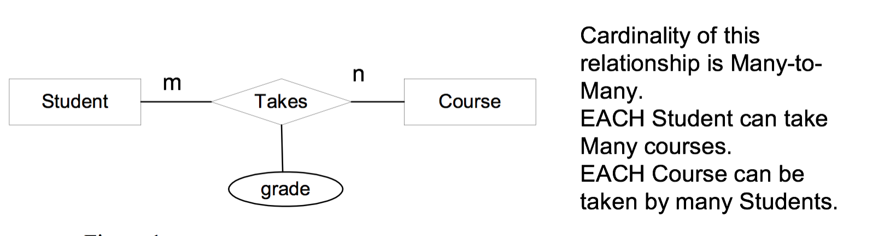
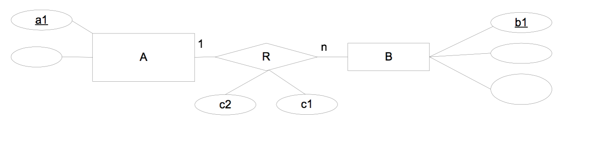

# Entity-Relationship Diagrams - ERDs

### Definition

Entity-Relationship Diagrams - ERDs - are used to represent information about the part of the real world for which you want to keep track of information.  An ERD consists of Entities and Relationships(cardinality).

An ERD representing the real world information is then converted to tables in the database.

### Purpose of Using ERD

Designing ERDs for an application is the first step towards designing a database for the application.  In general, the first stage of designing a database involves the following three steps:
* 1.) design the ERD.
* 2.) convert the ERD into tables.
* 3.) normalize each table to 1NF, 2NF or 3NF as befitting that table.

## E-R Diagram Details

### Entities

* Entities are __objects__ in the real world that you want to know some information about or you want to store information about in the database.  For example, in the student loan application, there are 4 entities: `student`, `bank`, `bank_rep`, and `loan`. “Student” is an entity because you want to know student information (or store student information in the database) such as `id`, `name`, `birthdate`, etc.

* Similar to tables in a relational database, an entity has attributes (or fields) and a primary key.  Attributes of an entity identify exactly what information you want to know (or want to store in the database) about that entity.

* There are three basic types of entities that you should look for when trying to identify entities.

  * __Concrete__ Objects: This type of entities has a physical presence. Examples are student, bank_rep, instructor, classroom, sales_rep, and product.
  * __Organizations__: Examples are bank, company, manufacturer, university, and supplier.
  * __Abstract__ objects: Examples are loan, course, skill, sale, transaction, and account.

  __It’s not important to distinguish what type of entity it is! It is only important that you identify all entities in an application.__

* Each __entity__, say "STUDENT", has many __instances__.  For example `id=1`, `name="Sauron"`, `birthdate=7/29/1959`, is an instance of Student Entity.  If you compare an entity to a table, an instance of the entity represents a row in a table.

### Relationships

#### Relationships are Interactions Between/Among Entities

* The most common relationships are relationships between two entities.  Examples are Student-TakesOut-Loan, Bank-Gives-Loan, Loan-IsSignedBy-BankRep, and BankRep-WorksFor-Bank.

"__Entity-Verb-Entity__" => E-V-E

* All relationships have cardinalities.

* A relationship may have its own attributes.

The value of this attribute, `grade` can only be determined after specifying a value for the primary key of Student, `student_id` and a value for the primary key of Course, `course_id`

### Cardinality of a relationship

#### There Are Three Types of Cardinalities:

### Here is the complete E-R representation of the student loan application:

### ERD and Functional Dependency (=>)

Primary key of an entity functionally determines all other attributes of an entity.  This is because primary key uniquely identifies each instance, which means that any particular value of the primary key can only appear in one instance, which then has only one value for any other attributes.

then a1=>b1, c1, c2  AND b1=>a1, c1, c2

This derives from the meaning of one-to-one relationship.  For each instance of A, there is only one instance of B corresponding to A.  So each attribute of a1 (which identifies an instance of A) corresponds to only one attribute of b1 (which identifies an instance of B). This means a1=>b1 and b1=>a1.

Then b1=>a1, c1, c2.  This derives directly from the meaning of one-to-many relationship. Each instance of B can correspond to only one instance of A.

Then a1+b1=>c1, c2.

This derives from the meaning of many-to-many relationship attributes.  The values of relationship attributes are determined by specifying a specific value of A and a specific value of B together.  When these two values are specified, the values of relationship attributes are determined.

### Converting an ERD into Tables in the Relational Database.

__Steps__:

 * Create a table for each entity in your ERD with the same attributes and the same primary key;
 * For each one-to-one relationship:
 	* ADD the primary key of A and all relationship attributes TO the TableB, OR ADD the primary key of TableB and all relationship attributes TO the table for TableA, OR merge tableA and TableB;
 * For each one-to-many relationship:
 	* ADD the primary key of the table corresponding to "the one" entity and all relationship attributes TO the table corresponding to "the many" entity;
 * For each many-to-many relationship:
 	* ADD A NEW TABLE, whose primary key consists of the combination of the primary keys of both entities involved in the relationship, whose other attributes are attributes of the many-to-many relationship.

Graphical Representation:

#### ER Diagram:

A: (a1, a2)	&&     B: (b1, b2, b3, c1, c2, a1)

A: (a1, a2, b1, c1, c2)	    &&	   B: (b1, b2, b3)

A: (a1, a2, b1, b2, b3, c1, c2)

Converts to :                             	
A: (a1, a2)

B: (b1, b2, b3, c1, c2, a1)

Converts to
A: (a1, a2)

B: (b1, b2, b3)

AB: (a1, b1, c1, c2)

### Example: Converting The ERD for Student Loan Applications to Tables.

#### Convert All Entities

* Student: (student_id, student_name, zipcode, student_level, age);
* Bank: (business_id, zipcode, type);
* Bank_Rep: (rep_id, rep_name);
* Loan: (loan_id, loan_date, years, interest_rate, amount);

#### Convert All Relationships:

__Student-TakesOut-Loan__: 1 to many, add the primary key of Student Entity to the Loan Table, get a new Loan table, which is, Loan: (loan_id, loan_date, years, interest_rate, amount, student_id);

__Bank-Gives-Loan__: 1 to many, add the primary key of Bank entity to the Loan Table, get yet a newer Loan Table, Loan: (loan_id, loan_date, years, interest_rate, amount, student_id, business_id);

__Bank-Rep-WorksFor-Bank__: 1 to many, Add the primary key of Bank Entity to the Bank_Rep Table, get a new Bank_Rep Table, get Bank_Rep: (rep_id, rep_name, business_id).

__Loan-IsSignedBy-BankRep__: 1 to many, Add the primary key of Bank_Rep to the newest Loan Table so far, get, Loan: (loan_id, loan_date, years, interest_rate, amount, student_id, business_id, rep_id);

#### Final Result:
* Student: (student_id, student_name, zipcode, student_level, age)
* Bank: (business_id, zipcode, type)
* Bank_Rep: (rep_id, rep_name, business_id)
* Loan: (loan_id, loan_date, years, interest_rate, amount, business_id, rep_id, student_id)

### Your Turn:

Think about the following entities and use an ERD to design an appropriate relational database schema.

* Employee: (employee_id, first_name, last_name, phone_number, age)
* Manager: (manager_id, first_name, last_name  )
* Branch: (branch_id, zipcode, type)
* Department: (department_id, name)
* Paycheck: (check_id, pay_date, witholdings, amount)
