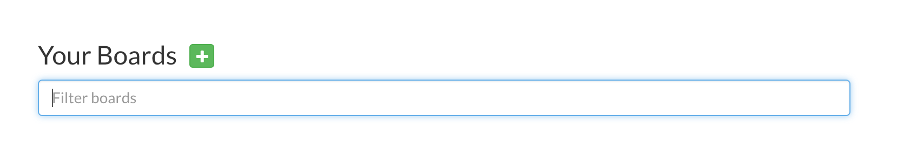

# Getting started with Waffle.io

## Getting Set Up

* First: make a repository on github for your project. If you already have a repository for a project then you'll just need to know the name of the repository.
* Second: when you visit waffle.io and log in you will see something like this:  Click the green '+' and fill in the name of your repo. If you are not the owner of the repository, that is it was not create under your github account, you will need to be added as a collaborator to have access to that repository.
* Third: now that you have added the 'board' that represents the github repository - go ahead and click the name of that repository to take you it's waffle board. Now you will see something that should look like this:  Your board will not have any 'cards' as you see in that example. Let's change this
* Fourth: Go ahead and click the blue 'Add Issue' button at the top of the page. You will get a prompt for a title and a description of the issue. The title of your issue should be the specific task you need to perform. The description will detail the work you need to do. What waffle is doing is making a github issue. You can assign different labels to the issue or you can select someone to assign this issue to (who will perform the task described on the card).
